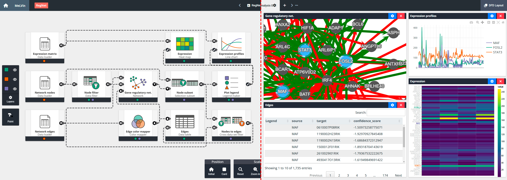

# MeLVin

MeLVin is a client–server application for designing interactive, coordinated data visualization applications. The client side features a web-based environment that uses visual programming through dataflow diagrams, allowing users to intuitively create and interconnect data processing and visualization operations. Serving as an abstraction layer atop existing visual grammars, declarative languages and libraries, MeLVin provides robust interoperability mechanisms to unify diverse underlying visualization technologies. Our user-friendly system enables the design and modular reuse of data analysis workflows. Both data processes and visualizations are encapsulated as “cards,” which can be saved, shared, and repurposed across different projects and among multiple users. This approach promotes collaboration, streamlines iterative development, and ultimately simplifies the creation of complex, high-quality data visualization environments.
## Dependencies

* **Docker 1.12** or above
* **Web Browser** with HTML5, CSS3, JavaScript with ECMAScript 2015 (ES6) support (any up-to-date version of Google Chrome, Mozilla Firefox or Microsoft Edge)

## Building
1. Download the current project:
   > git clone https://github.com/vg-lab/MeLVin.git
2. From the project's root directory, build the docker image:
   > docker build -t melvin .
3. Create the docker container from the previous image:
   > docker create --name melvin -p 80:80 melvin
## Running
In order to start the app use:
> docker start -i melvin

Now the tool will be available at `http://localhost:80`

Web Browser extensions may interfere in MeLVin's performance or functionality. If you have problems, please disable any extension that may interfere with the web-app.

To stop MeLVin use:
> docker stop melvin